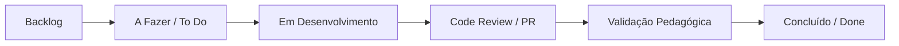

# 🚀 Guia Prático: Como Turbinar o Jira para a Plataforma IAprofEPT
> **Projeto de Doutorado:** IAprofEPT (PPGEM / UFJF)  
> **Autor da Pesquisa:** Maycon Luiz Amaral Magalhães  
> **Engenharia de Software:** Shayene Figueredo & Samuel Amorim  

Este guia foi elaborado para você configurar o Jira com recursos que darão **visibilidade total, rastreabilidade acadêmica e agilidade** durante todas as fases do projeto (de 22/09 a 15/12/2026).

---

## 📥 1. Como Importar o Arquivo CSV no Jira

1. No Jira, clique na engrenagem no topo direito (⚙️ **Configurações**) ou vá em **Projetos** ➔ **Importar de CSV**.
2. Selecione o arquivo: [`docs/jira_fase1_mvp_tasks.csv`](jira_fase1_mvp_tasks.csv).
3. Selecione o Projeto de destino (ex: `IAprofEPT` - chave `IAPROF`).
4. Faça o mapeamento simples dos campos:
   - `Issue Type` ➔ **Tipo de Item (Issue Type)**
   - `Summary` ➔ **Resumo (Summary)**
   - `Description` ➔ **Descrição (Description)**
   - `Priority` ➔ **Prioridade (Priority)**
   - `Component` ➔ **Componentes (Components)**
   - `Labels` ➔ **Etiquetas (Labels)**
   - `Epic Link` ➔ **Link do Épico (Parent / Epic Link)**
   - `Story Points` ➔ **Pontos de História (Story Points)**
   - `Fix Version` ➔ **Versão de Correção (Fix Versions)**
5. Clique em **Iniciar Importação**. Em poucos segundos, todo o backlog da Fase 1 estará criado e estruturado!

---

## 💡 2. Ideias Legais para Implementar no Jira

### 🏷️ A. Campos Personalizados (Custom Fields) com Vínculo Acadêmico
Crie alguns campos úteis para enriquecer a rastreabilidade da tese:
1. **Ambiente Vinculado (Lista suspensa):**
   - `1. Ambiente Formativo`
   - `2. Laboratório de IA`
   - `3. Repositório de Práticas`
   - `4. Painel de Reflexão`
   - `5. Prof. mAIcon / Suporte`
   - `Geral / Design System / Auth`
2. **Motor de IA (Multi-select para a Fase 2/3):**
   - `Groq (LLaMA 3.3 70B)`
   - `Google Gemini 1.5`
   - `Roteador A/B`
3. **Impacto na Tese (Texto curto / Caixa de seleção):**
   - Se a task gera dados ou gráficos para o relatório de Maycon.

---

### 🔄 B. Workflow Inteligente (Fluxo de Trabalho Personalizado)
Em vez do fluxo padrão (*To Do ➔ In Progress ➔ Done*), implemente um fluxo que garanta validação docente e técnica:

- **Validação Pedagógica:** Fase em que Maycon ou os professores testam a usabilidade da funcionalidade antes de dar como "Done".

---

### 🤖 C. Automações Úteis no Jira (Jira Automation)
1. **Sincronização com GitHub:**
   - Quando um Pull Request for aberto no GitHub com a tag `IAPROF-XX`, mover o card no Jira automaticamente para **Code Review**.
   - Quando o PR for mesclado na branch `main`, mover para **Concluído**.
2. **Notificação de Bloqueio:**
   - Se uma task for marcada como "Bloqueada" (Flagged), enviar alerta no e-mail ou Slack/WhatsApp do time.
3. **Atualização Automática do Épico:**
   - Quando todas as sub-tasks e stories de um épico forem concluídas, fechar o Épico da Fase automaticamente.

---

### 📊 D. Dashboards Visuais para Acompanhamento com a Orientação (UFJF)
Crie um Painel (Dashboard) no Jira com gadgets visuais para apresentar nas reuniões com os professores orientadores:
- **Gráfico de Burnup da Fase 1 (Meta 05/10):** Mostra o ritmo de entrega diário.
- **Gráfico de Pizza por Ambiente:** Proporção de tarefas concluídas por cada um dos 5 ambientes.
- **Quadro Kanban de Sprint Ativa:** Visualização rápida do que está em andamento com Shayene e Samuel.
- **Relatório de Versões (Releases):** Acompanhamento do progresso da release `v0.1.0-MVP`.

---

### 🔗 E. Integração Jira + GitHub
Para ativar a integração direta:
1. No Jira, vá em **Apps** ➔ **GitHub for Jira**.
2. Conecte sua conta do GitHub e dê permissão ao repositório `https://github.com/ShayeneFigueredo/IAProfEPT-plataforma`.
3. Pronto! Ao criar branches com o nome da task (ex: `feature/IAPROF-2-design-system`), o Jira exibirá os commits, branches e PRs dentro do próprio card da tarefa.
